# Power Management Integrated Circuits

The project provides an overview of Power Management Integrated Circuits. Please download the executable in https://github.com/alpaddesai/PowerManagementIntegratedCircuits/releases for details. 

Company confidential information is not displayed. All images are either custom by Alpa D Desai or a reference name is included.

## Low Voltage MOSFET
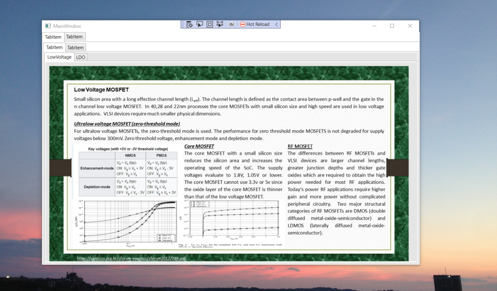

## Diffused MOS
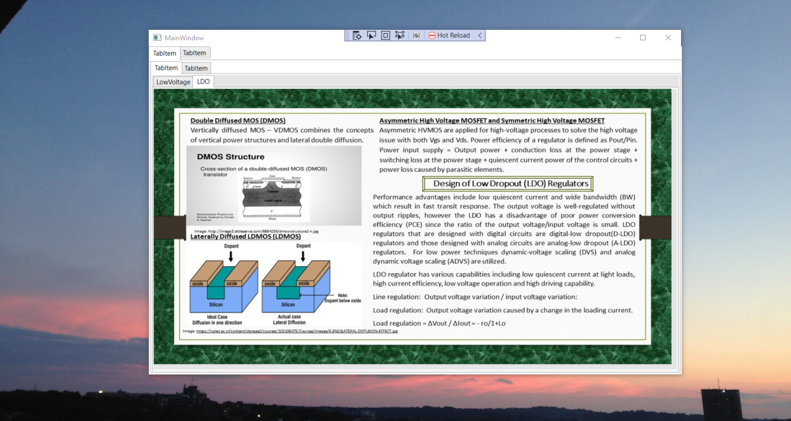

## LDO
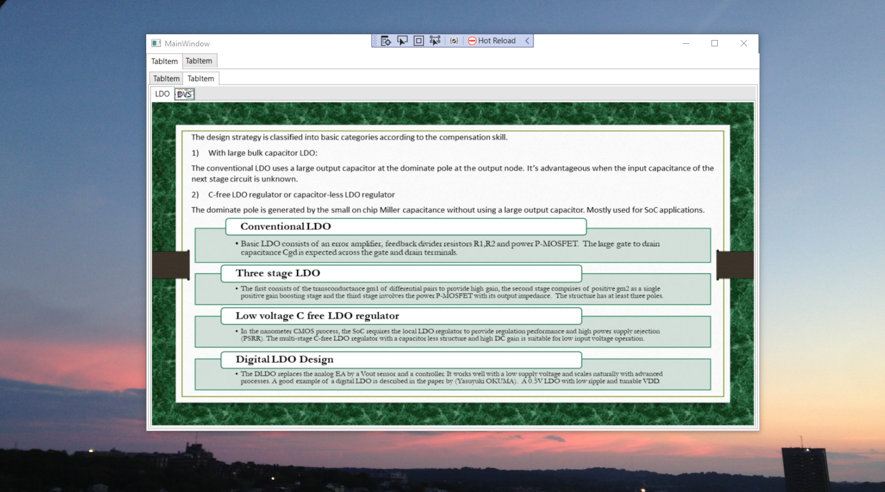

## DVS
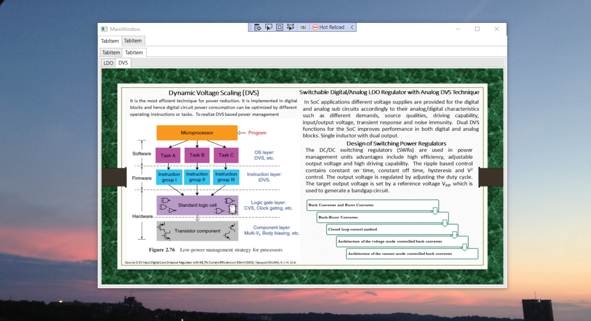

## Ripple Based Control 
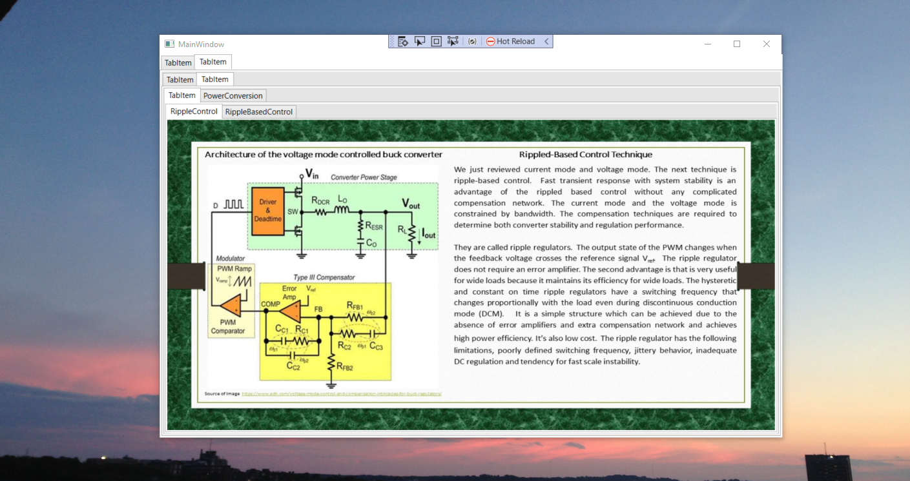

## Ripple Based Control
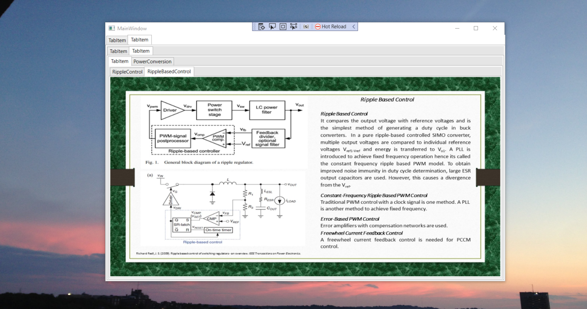

## Battery Charger 
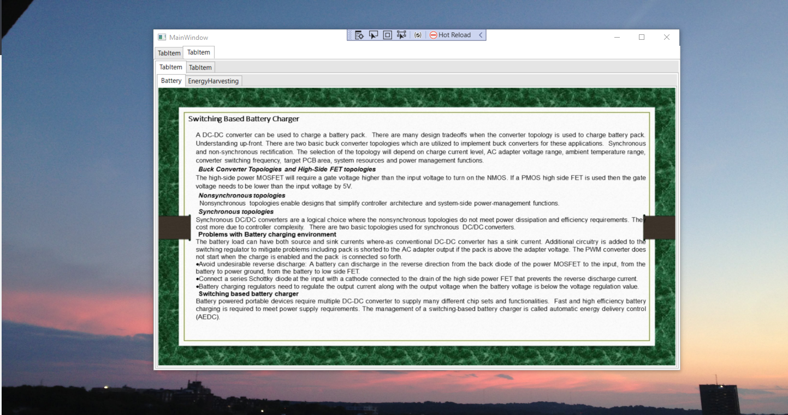

## Energy Harvester

## Single inductor multiple output
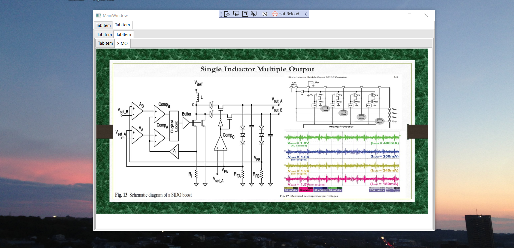
#### reference: Analog Circuit Design> power management Michiel Steyaert
## Power LDO 
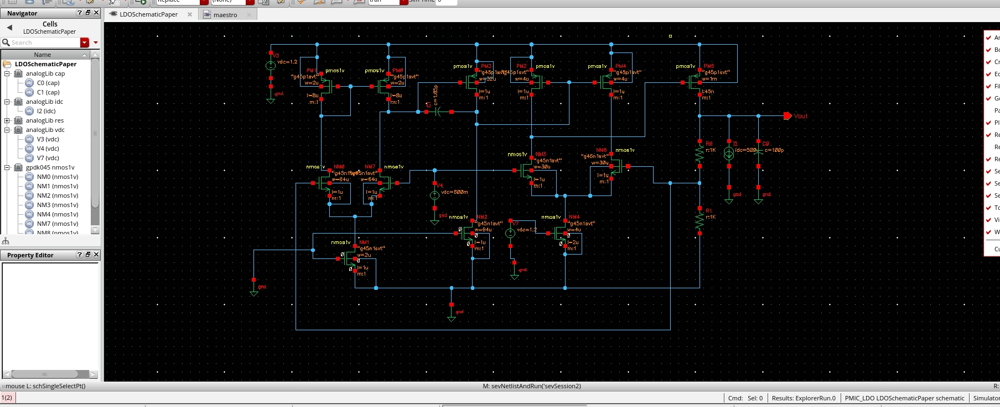
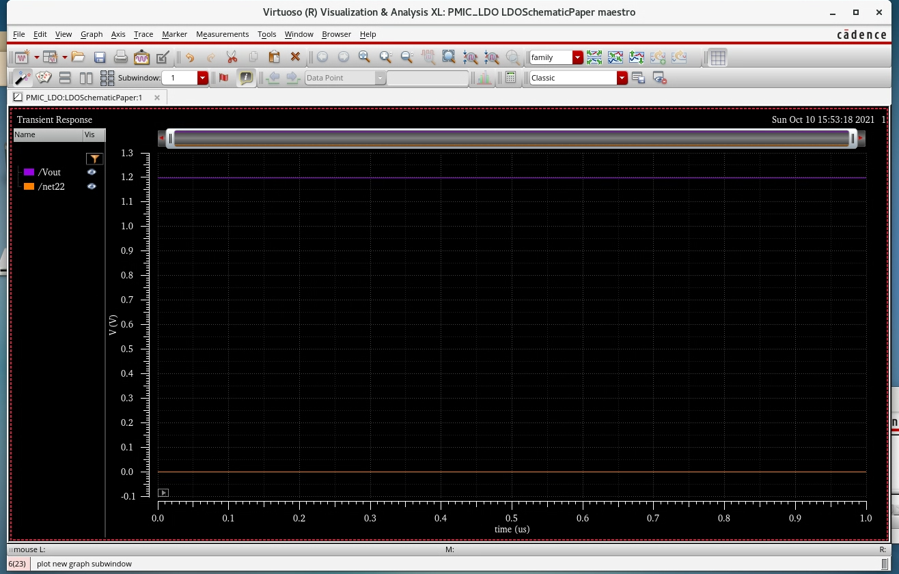
#### Reference: Capacitor Free LDO 180nm CMOS for hearing aids - Yoni Yosef-Hay, Pere Llimos Muntal, Dennis landLarsen , Ivan Jorgensen, Denmark

## DC Switchers
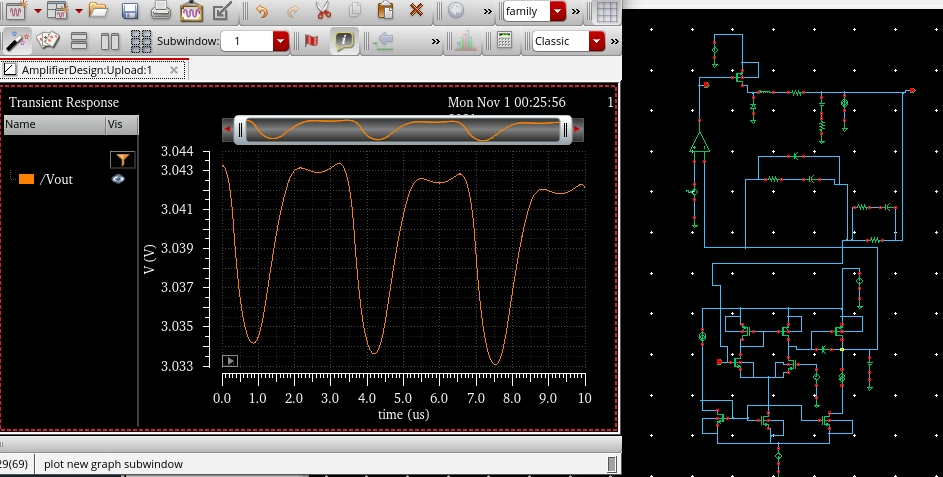

## In class
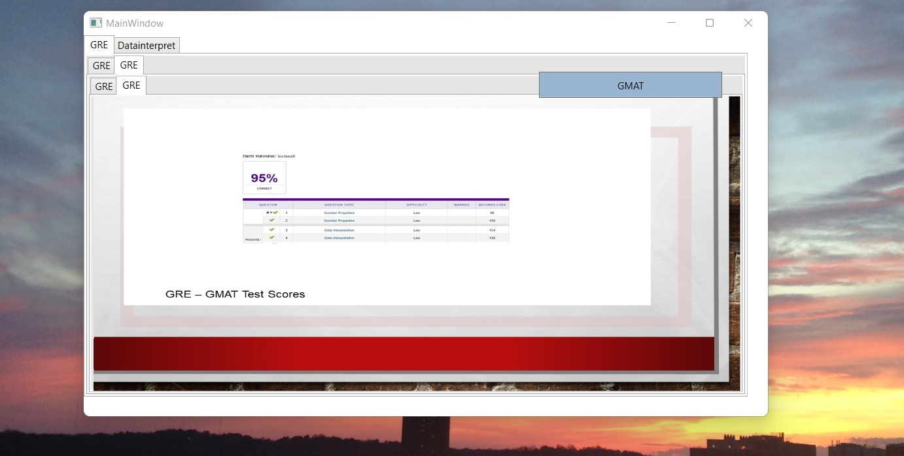

## Admission letter

## GMAT exam
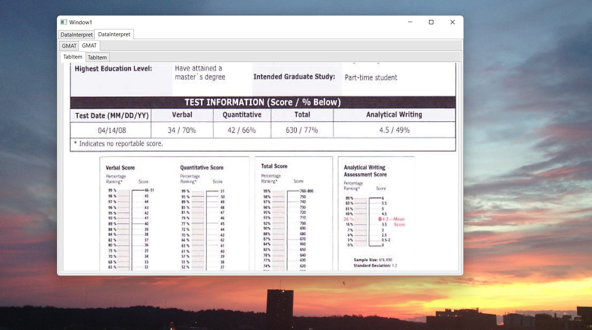

!image](Ethics.jpg)

Additional details: https://github.com/alpaddesai/MSECE_ArchitecturalDesign 
