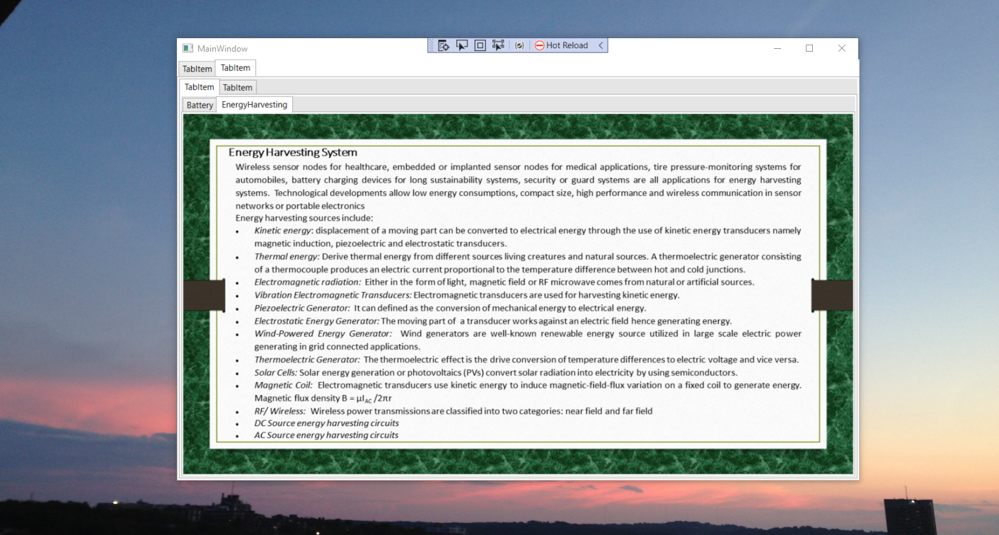

# Power Management Integrated Circuits

The project provides an overview of Power Management Integrated Circuits. Please download the executable in https://github.com/alpaddesai/PowerManagementIntegratedCircuits/releases for details. 

Company confidential information is not displayed. All images are either custom by Alpa D Desai or a reference name is included.

## Low Voltage MOSFET

## Diffused MOS

## LDO

## DVS

## Ripple Based Control 

## Ripple Based Control

## Battery Charger 

## Energy Harvester

## Power COnversion 

